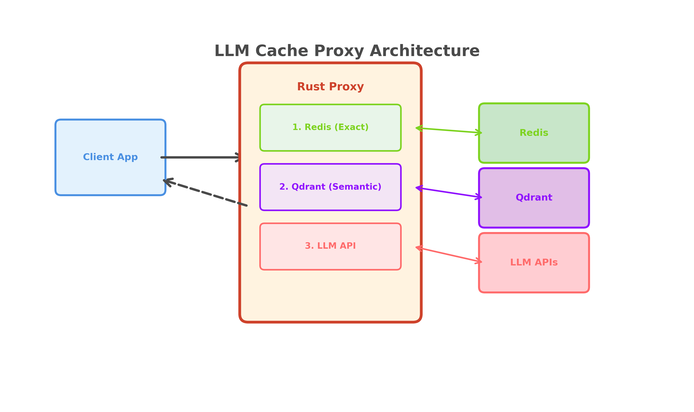

# LLM Cache Proxy


A caching proxy for LLM APIs, built in Rust. Sits between your application and the Groq API, serving cached responses instead of making redundant API calls. Drop-in compatible with any client that uses the OpenAI API format.

---

## Architecture



---

## How It Works

Every request passes through two cache tiers before reaching the LLM:

```
Request
  │
  ▼
Tier 1: Redis (exact match)       ← SHA256 hash lookup, sub-millisecond
  Hit  ──────────────────────────────→ Return cached response
  Miss
  │
  ▼
Tier 2: Qdrant (semantic match)   ← Vector similarity search (≥ 0.90 cosine)
  Hit  ──→ Promote to Redis ─────────→ Return cached response
  Miss
  │
  ▼
Tier 3: Groq API                  ← Only called when both caches miss
         Store in Redis + Qdrant ────→ Return response
```

**Tier 1 — Exact match (Redis):** The prompt is normalized and hashed with SHA256. Identical requests are served in ~4ms.

**Tier 2 — Semantic match (Qdrant):** The prompt is embedded into a 384-dimensional vector and compared against all previously cached prompts. If a semantically similar prompt is found (cosine similarity ≥ 0.90), its cached response is returned. The result is promoted to Redis so future identical requests skip this tier entirely.

**Tier 3 — LLM call (Groq):** On a full miss, the request is forwarded to Groq and the response is stored in both tiers.

---

## Services

| Service | Role | Port |
|---------|------|------|
| Rust proxy | Request handling, cache orchestration | 3000 |
| Redis | Exact match cache | 6379 |
| Qdrant | Vector store for semantic search | 6333 / 6334 |
| Python FastAPI | Text embedding service (`all-MiniLM-L6-v2`) | 8001 |

All four services are orchestrated via Docker Compose.

---

## Quick Start

```bash
git clone https://github.com/AmmarHassona/llm_cache_proxy.git
cd llm_cache_proxy
echo "GROQ_API_KEY=your-key" > .env
docker-compose up
```

Proxy runs at `http://localhost:3000`.

---

## Prerequisites

- [Docker](https://docs.docker.com/get-docker/) and Docker Compose
- A [Groq API key](https://console.groq.com) (free tier available)

---

## Setup

**1. Clone the repository**

```bash
git clone https://github.com/AmmarHassona/llm_cache_proxy.git
cd llm_cache_proxy
```

**2. Create your `.env` file**

```bash
cp .env.example .env
```

Open `.env` and add your Groq API key:

```env
GROQ_API_KEY=your-api-key-here
```

The remaining variables have working defaults for Docker Compose and do not need to be changed.

**3. Create the logs directory**

```bash
mkdir -p logs
```

**4. Start everything**

```bash
docker-compose up --build
```

The proxy starts on port 3000 once Redis, Qdrant, and the embedding service all pass their health checks. On first run, the embedding service downloads the `all-MiniLM-L6-v2` model (~80MB) — this takes about a minute.


---

## Usage

The proxy is a drop-in replacement for any OpenAI-compatible client. Just point `base_url` at `http://localhost:3000/v1`.

**With the OpenAI Python SDK:**

```python
from openai import OpenAI

client = OpenAI(
    base_url="http://localhost:3000/v1",
    api_key="any-string",  # proxy uses its own GROQ_API_KEY internally
)

response = client.chat.completions.create(
    model="llama-3.3-70b-versatile",
    messages=[{"role": "user", "content": "What is Rust?"}],
    temperature=0.0,
)
print(response.choices[0].message.content)
```

**With curl:**

```bash
curl -X POST http://localhost:3000/v1/chat/completions \
  -H "Content-Type: application/json" \
  -d '{
    "model": "llama-3.3-70b-versatile",
    "messages": [{"role": "user", "content": "What is Rust?"}],
    "temperature": 0.0
  }'
```

### Supported Models

Any Groq model works. Pricing in `/metrics` is accurate for:

`llama-3.3-70b-versatile` · `llama-3.1-8b-instant` · `llama-4-scout` · `llama-4-maverick` · `qwen3-32b` · `kimi-k2-0905-1t` · `gpt-oss-20b` · `gpt-oss-120b`

### Optional Request Headers

| Header | Example | Effect |
|--------|---------|--------|
| `x-bypass-cache` | `true` | Skip cache entirely, always call LLM |
| `x-cache-ttl` | `3600` | Override Redis TTL for this response (seconds) |

---

## Endpoints

| Method | Path | Description |
|--------|------|-------------|
| `POST` | `/v1/chat/completions` | Main proxy — OpenAI-compatible |
| `GET`  | `/health` | Live health check for all services |
| `GET`  | `/metrics` | Cache performance and cost breakdown |
| `GET`  | `/dashboard` | Live web dashboard |
| `POST` | `/admin/cache/clear` | Flush the Redis cache |
| `GET`  | `/admin/stats` | Metrics + service status combined |

---

## Dashboard

Open [http://localhost:3000/dashboard](http://localhost:3000/dashboard) after starting. It auto-refreshes every 5 seconds from `/metrics` and shows hit rate, token savings, cost savings, and cache distribution charts.

---

## Performance

Results from an 81-request benchmark across 9 scenarios (repeated queries, concurrent requests, and unique real-world questions). Tested using `llama-3.3-70b-versatile` on the Groq free tier.

**Response latency by cache tier:**

| Tier | Median | Mean | p95 |
|------|--------|------|-----|
| Exact hit (Redis) | 4ms | 4ms | 5ms |
| Semantic hit (Qdrant) | 8ms | 21ms | 83ms |
| Cache miss (Groq API) | 2,157ms | 2,182ms | 3,230ms |

**Hit rate by scenario:**

| Scenario | Hit Rate | Notes |
|----------|----------|-------|
| Repeated queries | 72% | Same questions sent multiple times |
| Concurrent requests | 65% | Same questions sent in parallel across workers |
| Similar phrasing | 66% | Paraphrases of the same question |
| Unique debugging questions | 10% | 10 genuinely different questions, cold cache |
| Unique architecture questions | 0% | 10 genuinely different questions, cold cache |

The cache performs best when traffic contains repeated or similar questions — FAQ bots, documentation assistants, or domain-specific tools. For a general-purpose assistant where every question is unique, hit rates will be low. 0 errors across all 81 requests.

---

## Testing

The performance test script using the OpenAI Python SDK is included:

```bash
cd python_embedding
source venv/bin/activate
python test_cache_performance.py
```

---

## Environment Variables

| Variable | Default | Description |
|----------|---------|-------------|
| `GROQ_API_KEY` | — | **Required.** Your Groq API key |
| `REDIS_URL` | `redis://127.0.0.1:6379` | Redis connection URL |
| `QDRANT_URL` | `http://127.0.0.1:6334` | Qdrant gRPC endpoint |
| `EMBEDDING_URL` | `http://127.0.0.1:8001/embed` | Embedding service endpoint |
| `LOG_PATH` | `./requests.log` | Path for the request log file |

When running via Docker Compose, the internal service hostnames are set automatically.

---

## Project Structure

```
.
├── src/
│   ├── main.rs        # App state, router setup
│   ├── handlers.rs    # HTTP handlers for all endpoints
│   ├── cache.rs       # Redis and Qdrant cache logic
│   ├── client.rs      # Groq API client
│   ├── models.rs      # Request/response types
│   ├── metrics.rs     # In-memory metrics counters
│   └── logger.rs      # Request log writer
├── python_embedding/
│   ├── main.py        # FastAPI embedding service
│   ├── test_cache_proxy.py  # Integration test script
│   ├── Dockerfile
│   └── requirements.txt
├── documentation/
│   ├── phase-1-basic-proxy.md
│   ├── phase-2-exact-match-caching.md
│   ├── phase-3-semantic-caching.md
│   └── phase-4-production-polish.md
├── dashboard.html     # Single-page dashboard (served at /dashboard)
├── docker-compose.yml
├── Dockerfile
├── Cargo.toml
└── .env.example
```

---

## Tech Stack

| Layer | Technology |
|-------|-----------|
| Proxy server | Rust — [Axum](https://github.com/tokio-rs/axum), [Tokio](https://tokio.rs), [reqwest](https://github.com/seanmonstar/reqwest) |
| Exact match cache | Redis |
| Semantic cache | Qdrant (vector database) |
| Embedding service | Python / FastAPI — [sentence-transformers](https://www.sbert.net/) (`all-MiniLM-L6-v2`) |
| Orchestration | Docker Compose |
| LLM backend | Groq API |

---

## License

This project is licensed under the [MIT License](LICENSE).
